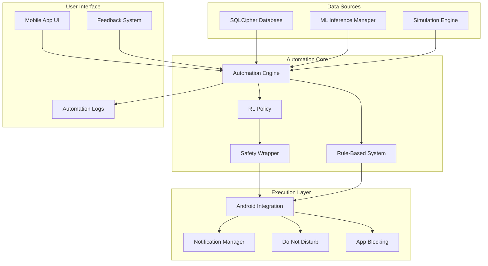

# Design Document: Automation Layer

## Overview

The Automation Layer is a sophisticated system that provides intelligent, personalized interventions to improve users' digital wellbeing. It combines deterministic rule-based automation for immediate responses with adaptive reinforcement learning policies for long-term personalization. The system operates entirely on-device to ensure privacy while leveraging behavioral insights from the data collection and ML systems.

## Architecture

The automation layer follows a hybrid architecture with three main components:



## Components and Interfaces

### 1. Automation Engine (Core Orchestrator)

The central component that coordinates all automation activities.

**Key Responsibilities:**
- Continuously monitor behavioral data from DataEngine
- Evaluate rule-based triggers and RL policy recommendations
- Coordinate between different automation strategies
- Manage user preferences and safety constraints
- Log all automation activities and outcomes

**Interface:**
```kotlin
class AutomationEngine(context: Context) {
    suspend fun initialize(): Boolean
    suspend fun evaluateInterventions(): List<InterventionRecommendation>
    suspend fun executeIntervention(intervention: InterventionRecommendation): InterventionResult
    fun updateUserFeedback(interventionId: String, feedback: UserFeedback)
    fun pauseAutomation(durationMinutes: Int)
    fun getAutomationStatus(): AutomationStatus
}
```

### 2. Rule-Based System

Implements deterministic automation rules based on behavioral thresholds and patterns.

**Key Features:**
- App category usage computation
- Time-based intervention triggers
- Threshold-based suggestions
- User preference integration
- Immediate response capability

**Rule Categories:**
- **Usage Thresholds**: Social media > 90min, work apps < 30% during work hours
- **Time-Based**: Late night usage, work hour patterns
- **Notification Patterns**: High frequency notifications during focus time
- **Inactivity Detection**: Extended periods without movement
- **Context-Aware**: Location, calendar, and environmental triggers

**Interface:**
```kotlin
class RuleBasedSystem {
    fun evaluateRules(context: BehavioralContext): List<RuleBasedIntervention>
    fun updateRuleThresholds(rules: Map<String, Any>)
    fun addCustomRule(rule: CustomRule)
    fun getActiveRules(): List<AutomationRule>
}
```

### 3. Reinforcement Learning Policy

Adaptive system that learns personalized intervention strategies over time.

**Architecture:**
- **Observation Space**: 50+ dimensional vector including usage patterns, time features, context
- **Action Space**: Discrete actions for intervention type, timing, and intensity
- **Reward Function**: Multi-objective optimization for wellbeing and user satisfaction
- **Policy Network**: Compact neural network optimized for mobile inference

**Observation Features:**
```python
observation_space = {
    'usage_features': [
        'social_usage_last_2h', 'work_usage_last_2h', 'total_screen_time_today',
        'notification_count_last_hour', 'app_switches_last_hour'
    ],
    'temporal_features': [
        'hour_of_day', 'day_of_week', 'is_weekend', 'is_work_hour'
    ],
    'context_features': [
        'location_type', 'calendar_busy', 'battery_level', 'charging_state'
    ],
    'historical_features': [
        'avg_usage_last_7d', 'intervention_success_rate', 'user_responsiveness'
    ],
    'wellbeing_metrics': [
        'predicted_energy', 'predicted_focus', 'predicted_mood'
    ]
}
```

**Action Space:**
```python
action_space = {
    'intervention_type': ['break_suggestion', 'dnd_enable', 'app_limit', 'focus_mode'],
    'timing': ['immediate', 'next_break', 'end_of_session'],
    'intensity': ['gentle', 'moderate', 'strong'],
    'duration': ['5min', '15min', '30min', '1hour']
}
```

**Interface:**
```kotlin
class RLPolicy {
    fun predict(observation: FloatArray): PolicyAction
    fun updateModel(newModelPath: String): Boolean
    fun getModelMetrics(): PolicyMetrics
    fun setExplorationRate(rate: Float)
}
```

### 4. Safety Wrapper

Ensures RL policy actions remain within safe and acceptable boundaries.

**Safety Constraints:**
- Maximum intervention frequency (max 1 per 30 minutes)
- Prohibited actions during emergency or important calls
- Respect for user-defined "never interrupt" periods
- Escalation prevention (no repeated strong interventions)
- Context-aware restrictions (no DND during work meetings)

**Interface:**
```kotlin
class SafetyWrapper {
    fun validateAction(action: PolicyAction, context: BehavioralContext): ValidationResult
    fun updateSafetyConstraints(constraints: SafetyConstraints)
    fun reportViolation(action: PolicyAction, reason: String)
}
```

### 5. Android Integration Layer

Handles all interactions with Android system APIs and services.

**Components:**
- **NotificationManager**: Posts intervention suggestions and feedback requests
- **DoNotDisturbManager**: Controls DND mode with proper permissions
- **AppBlockingManager**: Implements app usage limitations using accessibility services
- **PermissionManager**: Handles runtime permissions and graceful degradation

**Interface:**
```kotlin
class AndroidIntegration {
    suspend fun enableDoNotDisturb(reason: String, duration: Duration): Boolean
    suspend fun postInterventionNotification(intervention: Intervention): String
    suspend fun blockApps(packages: List<String>, duration: Duration): Boolean
    suspend fun requestPermissions(permissions: List<String>): PermissionResult
}
```

## Data Models

### Core Data Structures

```kotlin
data class BehavioralContext(
    val currentUsage: UsageSnapshot,
    val recentPatterns: UsagePatterns,
    val timeContext: TimeContext,
    val environmentContext: EnvironmentContext,
    val userState: UserState
)

data class InterventionRecommendation(
    val id: String,
    val type: InterventionType,
    val trigger: String,
    val confidence: Float,
    val reasoning: String,
    val suggestedTiming: Long,
    val expectedImpact: ImpactPrediction
)

data class InterventionResult(
    val interventionId: String,
    val executed: Boolean,
    val userResponse: UserResponse,
    val actualImpact: ImpactMeasurement?,
    val executionTime: Long
)

enum class InterventionType {
    BREAK_SUGGESTION,
    DND_ENABLE,
    APP_LIMIT_SUGGESTION,
    FOCUS_MODE_ENABLE,
    NOTIFICATION_REDUCTION,
    ACTIVITY_SUGGESTION
}

data class UserFeedback(
    val interventionId: String,
    val rating: Int, // 1-5 scale
    val helpful: Boolean,
    val timing: TimingFeedback,
    val comments: String?
)
```

### RL Training Data Structures

```python
@dataclass
class RLExperience:
    observation: np.ndarray
    action: int
    reward: float
    next_observation: np.ndarray
    done: bool
    user_feedback: Optional[float]
    
@dataclass
class TrainingBatch:
    experiences: List[RLExperience]
    metadata: Dict[str, Any]
    timestamp: datetime
```

## Correctness Properties

*A property is a characteristic or behavior that should hold true across all valid executions of a system-essentially, a formal statement about what the system should do. Properties serve as the bridge between human-readable specifications and machine-verifiable correctness guarantees.*

### Property 1: Rule-based intervention consistency
*For any* behavioral context that meets a rule's trigger conditions, the rule-based system should consistently suggest the same intervention type with similar confidence levels
**Validates: Requirements 1.1, 1.2, 1.3, 1.4, 1.5**

### Property 2: Safety constraint enforcement
*For any* RL policy action, the safety wrapper should prevent execution if the action violates any defined safety constraints
**Validates: Requirements 3.7, 5.1, 5.5**

### Property 3: User feedback integration
*For any* intervention that receives negative user feedback, the system should reduce the likelihood of similar interventions in similar contexts
**Validates: Requirements 3.2, 5.6**

### Property 4: Permission graceful degradation
*For any* Android permission that is denied, the automation system should continue operating with reduced functionality rather than failing completely
**Validates: Requirements 2.5**

### Property 5: Automation logging completeness
*For any* intervention that is executed, there should be a corresponding log entry with all required metadata
**Validates: Requirements 6.1, 6.2**

### Property 6: Battery optimization compliance
*For any* automation processing cycle, the execution time should remain under the specified performance threshold
**Validates: Requirements 8.1, 8.2**

### Property 7: Privacy data locality
*For any* behavioral data processed by the automation system, the data should remain on the local device and never be transmitted externally
**Validates: Requirements 9.1, 9.7**

### Property 8: RL policy bounded actions
*For any* RL policy recommendation, the suggested action should fall within the predefined action space boundaries
**Validates: Requirements 3.1, 3.4**

### Property 9: Intervention frequency limits
*For any* time window, the total number of interventions should not exceed the maximum frequency limits defined in safety constraints
**Validates: Requirements 5.1, 8.1**

### Property 10: User preference respect
*For any* intervention type that a user has disabled in preferences, the system should never suggest or execute that intervention type
**Validates: Requirements 5.2, 5.3**

## Error Handling

### Graceful Degradation Strategy

1. **Permission Failures**: Continue with available permissions, inform user of limitations
2. **ML Model Unavailable**: Fall back to rule-based system only
3. **Database Errors**: Cache recent data, retry with exponential backoff
4. **Android API Failures**: Log error, attempt alternative approaches
5. **Network Unavailable**: Continue with local-only functionality

### Error Recovery Mechanisms

- **Automatic Retry**: Transient failures with exponential backoff
- **Fallback Systems**: Rule-based backup for RL policy failures
- **User Notification**: Clear error messages with suggested actions
- **Diagnostic Logging**: Comprehensive error tracking for debugging
- **Safe Mode**: Minimal functionality mode when critical errors occur

## Testing Strategy

### Dual Testing Approach

**Unit Tests:**
- Rule evaluation logic with various behavioral contexts
- RL policy inference with different observation vectors
- Safety wrapper constraint validation
- Android integration permission handling
- Data serialization and persistence

**Property-Based Tests:**
- Generate random behavioral contexts and verify consistent rule evaluation
- Test RL policy actions remain within valid bounds across all possible observations
- Verify safety constraints prevent harmful actions under all conditions
- Validate user feedback integration across diverse intervention scenarios
- Test automation logging completeness with various intervention types

### Property Test Configuration

- Minimum 100 iterations per property test
- Each test tagged with: **Feature: automation-layer, Property {number}: {property_text}**
- Use Kotest property testing framework for Kotlin components
- Use Hypothesis for Python RL training components

### Integration Testing

- End-to-end automation workflows with real Android APIs
- RL policy training and deployment pipeline validation
- Cross-component data flow verification
- Performance benchmarking under various load conditions
- Battery usage measurement and optimization validation

### A/B Testing Framework

- Compare rule-based vs RL policy effectiveness
- Measure user satisfaction across different intervention strategies
- Evaluate long-term behavioral change outcomes
- Test different reward function formulations
- Validate safety constraint effectiveness

## Performance Considerations

### Mobile Optimization

- **Model Quantization**: 8-bit quantized RL models for faster inference
- **Batch Processing**: Group database operations to minimize I/O
- **Lazy Loading**: Load components only when needed
- **Memory Management**: Efficient cleanup of temporary data structures
- **Background Processing**: Use WorkManager for optimal scheduling

### Scalability Design

- **Modular Architecture**: Easy to add new intervention types
- **Plugin System**: Support for custom rules and policies
- **Configuration-Driven**: Behavior modification without code changes
- **Horizontal Scaling**: Support for multiple concurrent users (future)
- **Resource Monitoring**: Self-monitoring and adaptive behavior

## Security Considerations

### Data Protection

- **Local Processing**: All sensitive data remains on device
- **Encryption**: Use existing SQLCipher encryption for automation logs
- **Access Control**: Restrict automation data access to authorized components
- **Audit Trail**: Comprehensive logging of all data access and modifications

### Privacy Preservation

- **Differential Privacy**: Add noise to aggregated training data
- **Federated Learning**: Future support for collaborative model improvement
- **User Consent**: Clear opt-in/opt-out mechanisms for all features
- **Data Minimization**: Collect only necessary data for automation functionality

## Future Enhancements

### Advanced RL Capabilities

- **Multi-Agent Systems**: Coordinate multiple specialized policies
- **Hierarchical RL**: Long-term planning with short-term execution
- **Meta-Learning**: Rapid adaptation to new users and contexts
- **Causal Inference**: Understanding intervention effectiveness mechanisms

### Enhanced Integration

- **Wearable Integration**: Incorporate physiological signals
- **Calendar Integration**: Context-aware scheduling of interventions
- **Social Features**: Collaborative wellbeing goals and challenges
- **Voice Interface**: Natural language interaction with automation system

### Advanced Analytics

- **Predictive Modeling**: Anticipate user needs before problems arise
- **Behavioral Clustering**: Identify user archetypes for better personalization
- **Intervention Optimization**: Continuous improvement of intervention strategies
- **Long-term Impact Tracking**: Measure sustained behavioral changes over months