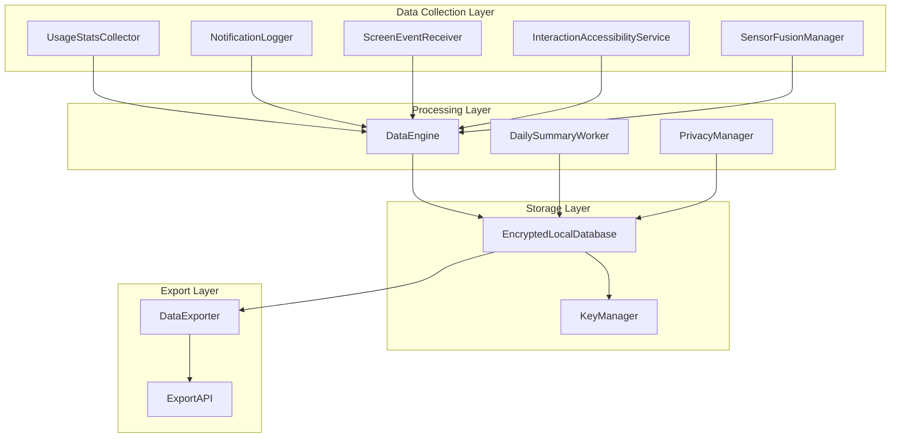

# Design Document

## Overview

The Data Collection & Local Intelligence system forms the foundational layer of LifeTwin OS, responsible for capturing, processing, and securely storing user behavioral data on Android devices. The system employs a multi-collector architecture with encrypted local storage, intelligent aggregation, and privacy-first design principles.

The architecture prioritizes on-device processing to maintain user privacy while providing rich behavioral insights through machine learning-ready data structures. All sensitive data remains encrypted on the device, with only aggregated summaries available for optional cloud synchronization.

## Architecture

The system follows a layered architecture with clear separation of concerns:



### Component Responsibilities

- **Data Collectors**: Specialized services for capturing specific types of behavioral data
- **Data Engine**: Central coordinator for data validation, transformation, and routing
- **Daily Summary Worker**: Background processor for aggregating raw events into insights
- **Encrypted Local Database**: SQLCipher-based secure storage with key management
- **Privacy Manager**: Permission handling, data retention, and user control enforcement
- **Data Exporter**: User-controlled data portability and backup functionality

## Components and Interfaces

### UsageStatsCollector

Leverages Android's UsageStatsManager API to capture app usage patterns with high accuracy and minimal battery impact.

```kotlin
interface UsageStatsCollector {
    suspend fun collectUsageEvents(timeRange: TimeRange): List<UsageEvent>
    suspend fun startContinuousCollection()
    suspend fun stopCollection()
    fun isPermissionGranted(): Boolean
}

data class UsageEvent(
    val packageName: String,
    val startTime: Long,
    val endTime: Long,
    val totalTimeInForeground: Long,
    val lastTimeUsed: Long,
    val eventType: UsageEventType
)
```

**Implementation Strategy**: 
- Uses WorkManager for periodic collection with battery-optimized constraints
- Implements intelligent batching to reduce database writes
- Handles permission changes gracefully with fallback mechanisms
- Respects Android's usage access permission requirements

### NotificationLogger

Captures notification interaction patterns through NotificationListenerService while respecting user privacy.

```kotlin
interface NotificationLogger {
    suspend fun logNotificationPosted(notification: NotificationData)
    suspend fun logNotificationInteraction(interaction: NotificationInteraction)
    fun startListening()
    fun stopListening()
}

data class NotificationData(
    val packageName: String,
    val timestamp: Long,
    val category: String?,
    val priority: Int,
    val hasActions: Boolean,
    val isOngoing: Boolean
)
```

**Privacy Considerations**:
- Stores only metadata, never notification content or personal information
- Filters system notifications to focus on user-relevant interactions
- Implements automatic data anonymization for sensitive app categories

### ScreenEventReceiver

Monitors device usage sessions through screen state changes and unlock events.

```kotlin
interface ScreenEventReceiver {
    suspend fun startMonitoring()
    suspend fun stopMonitoring()
    suspend fun getCurrentSession(): ScreenSession?
}

data class ScreenSession(
    val sessionId: String,
    val startTime: Long,
    val endTime: Long?,
    val unlockCount: Int,
    val interactionIntensity: Float
)
```

**Battery Optimization**:
- Uses efficient BroadcastReceiver registration
- Implements session coalescing for rapid screen on/off events
- Minimizes wake locks and background processing

### InteractionAccessibilityService

Captures interaction patterns while strictly adhering to Play Store policies and user privacy.

```kotlin
interface InteractionAccessibilityService {
    suspend fun startCapturing()
    suspend fun stopCapturing()
    suspend fun getInteractionMetrics(): InteractionMetrics
}

data class InteractionMetrics(
    val touchCount: Int,
    val scrollEvents: Int,
    val gesturePatterns: List<GestureType>,
    val interactionIntensity: Float,
    val timeWindow: TimeRange
)
```

**Compliance Strategy**:
- Aggregates interaction patterns without storing specific coordinates or content
- Implements strict data minimization principles
- Provides clear user explanations for accessibility permission usage

### SensorFusionManager

Combines accelerometer and contextual sensors for activity recognition and behavioral context.

```kotlin
interface SensorFusionManager {
    suspend fun startSensorCollection()
    suspend fun stopSensorCollection()
    suspend fun getCurrentActivity(): ActivityContext
}

data class ActivityContext(
    val activityType: ActivityType,
    val confidence: Float,
    val timestamp: Long,
    val duration: Long
)

enum class ActivityType {
    STATIONARY, WALKING, IN_VEHICLE, ON_BICYCLE, RUNNING, UNKNOWN
}
```

**Efficiency Features**:
- Batches sensor readings to minimize battery drain
- Uses adaptive sampling rates based on detected activity
- Implements intelligent sensor fusion algorithms for accurate activity detection

### PrivacyManager

Provides comprehensive user control over data collection with granular privacy customization options.

```kotlin
interface PrivacyManager {
    suspend fun setCollectorEnabled(collector: CollectorType, enabled: Boolean)
    suspend fun setDataRetentionPeriod(period: RetentionPeriod)
    suspend fun setPrivacyLevel(level: PrivacyLevel)
    suspend fun getPrivacySettings(): PrivacySettings
    suspend fun exportPrivacyReport(): PrivacyReport
    suspend fun setAnonymizationLevel(level: AnonymizationLevel)
    suspend fun configureDataSharing(settings: DataSharingSettings)
}

data class PrivacySettings(
    val enabledCollectors: Set<CollectorType>,
    val dataRetentionDays: Int,
    val privacyLevel: PrivacyLevel,
    val anonymizationSettings: AnonymizationSettings,
    val exportSettings: ExportSettings,
    val dataSharingSettings: DataSharingSettings
)

enum class PrivacyLevel {
    MINIMAL,    // Only basic screen time and app categories
    STANDARD,   // Includes notifications and interaction patterns  
    DETAILED    // Full behavioral analysis with sensor data
}

data class AnonymizationSettings(
    val aggregateAppUsage: Boolean,
    val removePersonalIdentifiers: Boolean,
    val fuzzTimestamps: Boolean,
    val categoryOnlyMode: Boolean,
    val minimumAggregationWindow: Duration
)

data class DataSharingSettings(
    val allowCloudSync: Boolean,
    val allowAnalytics: Boolean,
    val allowResearchParticipation: Boolean,
    val encryptionRequired: Boolean
)
```

**Privacy Customization Features**:
- **Granular Collector Control**: Users can enable/disable individual data collectors independently
- **Privacy Levels**: Predefined privacy levels from minimal to detailed data collection with clear explanations
- **Data Retention Control**: User-configurable retention periods from 1 day to 1 year with automatic cleanup
- **Anonymization Options**: Multiple levels of data anonymization including timestamp fuzzing and identifier removal
- **Transparency Dashboard**: Real-time view of what data is being collected, how it's used, and storage locations
- **Data Sharing Controls**: Granular control over cloud sync, analytics participation, and research data sharing
- **Audit Trail**: Complete log of privacy setting changes and data access events
- **Emergency Privacy Mode**: One-tap option to immediately stop all data collection and purge recent data

## Data Models

### Core Event Schema

```kotlin
@Entity(tableName = "raw_events")
data class RawEvent(
    @PrimaryKey val id: String,
    val timestamp: Long,
    val eventType: EventType,
    val packageName: String?,
    val duration: Long?,
    val metadata: String, // Encrypted JSON
    val processed: Boolean = false
)

@Entity(tableName = "daily_summaries")
data class DailySummary(
    @PrimaryKey val date: String, // YYYY-MM-DD
    val totalScreenTime: Long,
    val appUsageDistribution: String, // Encrypted JSON
    val notificationCount: Int,
    val peakUsageHour: Int,
    val activityBreakdown: String, // Encrypted JSON
    val createdAt: Long,
    val version: Int = 1
)
```

### Database Schema Design

The database uses a hybrid approach with raw events for short-term storage and processed summaries for long-term insights:

- **Raw Events**: Stored for 7 days maximum, then automatically purged after summary processing
- **Daily Summaries**: Retained indefinitely with user-controlled export and deletion
- **Metadata Tables**: Store encryption keys, user preferences, and system configuration

## Correctness Properties

*A property is a characteristic or behavior that should hold true across all valid executions of a system—essentially, a formal statement about what the system should do. Properties serve as the bridge between human-readable specifications and machine-verifiable correctness guarantees.*

### Property Reflection

After analyzing all acceptance criteria, several properties can be consolidated to eliminate redundancy:

- **Data Collection Properties**: Multiple collectors have similar recording behaviors that can be unified
- **Database Properties**: Storage, encryption, and export behaviors share common patterns
- **Processing Properties**: Aggregation and calculation behaviors follow similar patterns
- **Performance Properties**: Batching and optimization behaviors can be combined

### Core Properties

**Property 1: Event Recording Consistency**
*For any* behavioral event (app launch, notification, screen change, interaction, sensor reading), when the event occurs, the corresponding collector should record it with accurate timestamp and metadata
**Validates: Requirements 1.1, 1.2, 2.1, 2.2, 2.3, 3.1, 3.2, 4.1, 5.1**

**Property 2: Database Persistence Guarantee**
*For any* collected event, when it is processed by a data collector, it should be persisted to the encrypted local database immediately and be retrievable through queries
**Validates: Requirements 1.4, 6.2**

**Property 3: Time Range Query Accuracy**
*For any* time range query, all returned events should have timestamps within the specified range, and no events within the range should be omitted
**Validates: Requirements 1.3**

**Property 4: Data Encryption Integrity**
*For any* personally identifiable information stored in the database, it should be encrypted using SQLCipher and unreadable without the proper decryption key
**Validates: Requirements 6.1, 6.2, 6.3**

**Property 5: Aggregation Accuracy**
*For any* set of raw events, when processed by the Daily Summary Worker, the calculated metrics (screen time, app usage distribution, notification counts) should accurately reflect the input data
**Validates: Requirements 7.2, 3.4**

**Property 6: Privacy Preservation Through Aggregation**
*For any* summary creation process, raw events should be aggregated into privacy-preserving summaries and original detailed events should be removed after the retention period
**Validates: Requirements 7.3, 8.4**

**Property 7: Session Coalescing Behavior**
*For any* sequence of rapid screen on/off events occurring within a threshold time window, they should be treated as a single continuous session
**Validates: Requirements 3.5**

**Property 8: Notification Filtering Accuracy**
*For any* notification event, only user-relevant app notifications should be stored, while system notifications should be filtered out
**Validates: Requirements 2.4**

**Property 9: Activity Detection Consistency**
*For any* accelerometer data input, the Sensor Fusion Manager should classify it into one of the defined activity states with appropriate confidence levels
**Validates: Requirements 5.1**

**Property 10: Data Export Completeness**
*For any* export request, the generated files should contain all user data matching the export criteria and maintain data integrity for successful re-import
**Validates: Requirements 9.1, 9.2, 9.3, 9.4, 9.5**

**Property 11: Batching Optimization**
*For any* sequence of data collection operations, they should be batched together to minimize database writes and system resource usage
**Validates: Requirements 10.1, 5.3**

**Property 12: Adaptive Performance Behavior**
*For any* low battery condition, data collection frequency should be automatically reduced while maintaining core functionality
**Validates: Requirements 10.3**

**Property 13: Component Independence Control**
*For any* individual data collector, it should be possible to enable or disable it independently without affecting other collectors
**Validates: Requirements 8.2**

**Property 14: Performance Metrics Availability**
*For any* system operation, performance metrics should be available and accurately reflect the actual system impact
**Validates: Requirements 10.5**

**Property 15: Weekly Summary Aggregation**
*For any* set of daily summaries, weekly summaries should be generated by properly combining daily data with trend analysis
**Validates: Requirements 7.4**

<function_calls>
<invoke name="prework">
<parameter name="featureName">data-collection-intelligence

## Error Handling

### Permission Management
- **Graceful Degradation**: When permissions are revoked, affected collectors disable cleanly without crashing
- **User Communication**: Clear explanations provided when permissions are needed
- **Fallback Mechanisms**: Alternative data sources used when primary collectors are unavailable

### Data Collection Failures
- **Retry Logic**: Exponential backoff for transient failures with maximum retry limits
- **Error Logging**: Comprehensive logging for debugging while preserving user privacy
- **Partial Success Handling**: Continue operation when some collectors fail

### Database Operations
- **Transaction Safety**: All database operations wrapped in transactions for consistency
- **Corruption Recovery**: Automatic database repair and backup restoration capabilities
- **Storage Space Management**: Automatic cleanup when storage space is low

### System Resource Constraints
- **Memory Pressure**: Automatic data structure optimization under memory constraints
- **Battery Optimization**: Adaptive collection frequency based on battery level
- **Network Availability**: Intelligent scheduling of network-dependent operations

## Testing Strategy

### Dual Testing Approach

The system requires both unit testing and property-based testing for comprehensive coverage:

**Unit Tests**: Focus on specific examples, edge cases, and integration scenarios
- Permission state changes and graceful degradation
- Database migration and corruption recovery
- Specific error conditions and boundary cases
- Integration between collectors and storage layer

**Property-Based Tests**: Verify universal properties across all inputs
- Data collection accuracy across random event sequences
- Encryption integrity with random data sets
- Aggregation correctness with varied input patterns
- Performance characteristics under different load conditions

### Property-Based Testing Configuration

- **Testing Framework**: Use Kotest Property Testing for Kotlin components
- **Test Iterations**: Minimum 100 iterations per property test for statistical confidence
- **Test Tagging**: Each property test tagged with format: **Feature: data-collection-intelligence, Property {number}: {property_text}**
- **Data Generators**: Smart generators that create realistic behavioral data patterns
- **Constraint Validation**: Generators respect real-world constraints (valid timestamps, realistic usage patterns)

### Testing Coverage Requirements

**Core Functionality Tests**:
- All data collectors with realistic usage scenarios
- Database operations including encryption/decryption cycles
- Summary generation with various data patterns
- Export/import round-trip validation

**Performance and Resource Tests**:
- Battery impact measurement under different collection frequencies
- Memory usage profiling with large datasets
- Database performance with realistic data volumes
- Background processing efficiency validation

**Security and Privacy Tests**:
- Encryption key management and rotation
- Data anonymization verification
- Permission boundary enforcement
- Secure data deletion validation

### Integration Testing Strategy

**End-to-End Scenarios**:
- Complete data collection lifecycle from raw events to summaries
- Permission revocation and restoration flows
- Device restart and data persistence validation
- Export and import data portability verification

**Performance Benchmarking**:
- Battery drain measurement over extended periods
- Memory usage profiling under various load conditions
- Database query performance with realistic data volumes
- Background processing impact on device responsiveness