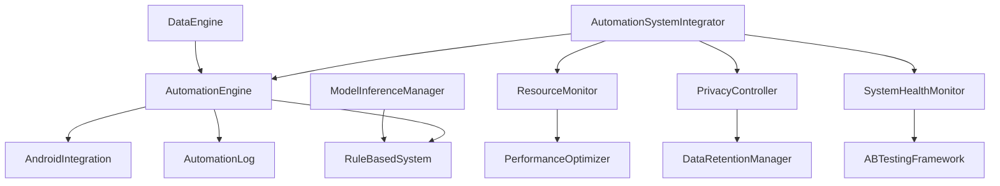

# Automation Layer Deployment Guide

## Overview

The Automation Layer provides intelligent digital wellbeing interventions through a hybrid rule-based and machine learning approach. This guide covers deployment, configuration, and operational procedures.

## Architecture Overview



## System Requirements

### Hardware Requirements
- **RAM**: Minimum 4GB, Recommended 6GB+
- **Storage**: 500MB free space for automation system
- **Battery**: Optimized for devices with 3000mAh+ batteries
- **CPU**: ARM64 or x86_64 architecture

### Software Requirements
- **Android**: API Level 26+ (Android 8.0+)
- **Kotlin**: 1.8.0+
- **Coroutines**: 1.6.0+
- **SQLCipher**: 4.5.0+

### Permissions Required
```xml
<!-- Core automation permissions -->
<uses-permission android:name="android.permission.USAGE_STATS" />
<uses-permission android:name="android.permission.BIND_NOTIFICATION_LISTENER_SERVICE" />
<uses-permission android:name="android.permission.BIND_ACCESSIBILITY_SERVICE" />

<!-- System monitoring permissions -->
<uses-permission android:name="android.permission.BATTERY_STATS" />
<uses-permission android:name="android.permission.ACCESS_NETWORK_STATE" />

<!-- Background processing -->
<uses-permission android:name="android.permission.WAKE_LOCK" />
<uses-permission android:name="android.permission.FOREGROUND_SERVICE" />
```

## Installation Steps

### 1. Dependencies Setup

Add to `build.gradle.kts`:

```kotlin
dependencies {
    // Core automation
    implementation("org.jetbrains.kotlinx:kotlinx-coroutines-android:1.6.4")
    implementation("org.jetbrains.kotlinx:kotlinx-serialization-json:1.5.1")
    
    // Database
    implementation("net.zetetic:android-database-sqlcipher:4.5.4")
    
    // Security
    implementation("androidx.security:security-crypto:1.1.0-alpha06")
    
    // Background processing
    implementation("androidx.work:work-runtime-ktx:2.8.1")
    
    // Testing
    testImplementation("io.kotest:kotest-runner-junit5:5.6.2")
    testImplementation("io.kotest:kotest-property:5.6.2")
}
```

### 2. Database Migration

Add automation entities to your database schema:

```kotlin
@Database(
    entities = [
        // Existing entities...
        AutomationLogEntity::class,
        BehavioralContextEntity::class
    ],
    version = 5, // Increment from current version
    exportSchema = false
)
abstract class AppDatabase : RoomDatabase() {
    // Existing DAOs...
    abstract fun automationLogDao(): AutomationLogDao
    abstract fun behavioralContextDao(): BehavioralContextDao
}
```

### 3. System Integration

Initialize the automation system in your Application class:

```kotlin
class LifeTwinApplication : Application() {
    private lateinit var automationIntegrator: AutomationSystemIntegrator
    
    override fun onCreate() {
        super.onCreate()
        
        // Initialize automation system
        automationIntegrator = AutomationSystemIntegrator(this)
        
        // Register lifecycle callbacks
        registerActivityLifecycleCallbacks(AutomationLifecycleCallbacks(automationIntegrator))
    }
}
```

### 4. Manifest Configuration

Add required services and receivers:

```xml
<application>
    <!-- Automation Services -->
    <service
        android:name=".automation.BackgroundAutomationWorker"
        android:enabled="true"
        android:exported="false" />
    
    <!-- Accessibility Service -->
    <service
        android:name=".automation.InteractionAccessibilityService"
        android:permission="android.permission.BIND_ACCESSIBILITY_SERVICE"
        android:exported="true">
        <intent-filter>
            <action android:name="android.accessibilityservice.AccessibilityService" />
        </intent-filter>
        <meta-data
            android:name="android.accessibilityservice"
            android:resource="@xml/accessibility_service_config" />
    </service>
    
    <!-- Notification Listener -->
    <service
        android:name=".automation.NotificationLogger"
        android:permission="android.permission.BIND_NOTIFICATION_LISTENER_SERVICE"
        android:exported="true">
        <intent-filter>
            <action android:name="android.service.notification.NotificationListenerService" />
        </intent-filter>
    </service>
</application>
```

## Configuration

### 1. Privacy Settings

Configure default privacy settings:

```kotlin
val defaultPrivacySettings = PrivacySettings(
    allowDataCollection = true,
    allowBehavioralAnalysis = true,
    allowRLLearning = false, // Start with rule-based only
    anonymizeData = true,
    dataRetentionDays = 90,
    encryptAllData = true
)

automationIntegrator.callApiEndpoint("automation/configure", mapOf(
    "settings" to mapOf(
        "privacySettings" to defaultPrivacySettings
    )
))
```

### 2. Performance Tuning

Configure performance parameters:

```kotlin
val performanceConfig = mapOf(
    "processingFrequency" to 1.0, // Normal frequency
    "batchSize" to 50,
    "cacheSize" to 100,
    "backgroundProcessing" to true
)
```

### 3. Rule Configuration

Set up initial automation rules:

```kotlin
val ruleConfig = mapOf(
    "socialMediaLimit" to 120, // 2 hours per day
    "lateNightCutoff" to 23, // 11 PM
    "workHoursStart" to 9,
    "workHoursEnd" to 17,
    "notificationLimit" to 50 // per hour
)
```

## API Endpoints

### Core Automation
- `automation/start` - Start automation system
- `automation/stop` - Stop automation system  
- `automation/status` - Get system status
- `automation/configure` - Update configuration

### Monitoring
- `automation/health` - System health report
- `automation/diagnostics` - Run diagnostics
- `automation/metrics` - Performance metrics

### Privacy & Data
- `automation/privacy/status` - Privacy compliance report
- `automation/privacy/export` - Export user data
- `automation/logs` - Get automation logs

### A/B Testing
- `automation/ab-test/status` - Current experiments
- `automation/ab-test/results` - Experiment results

## Monitoring and Maintenance

### 1. Health Monitoring

Monitor system health regularly:

```kotlin
// Check system health
val health = automationIntegrator.callApiEndpoint("automation/health") as SystemHealthReport

if (health.overallHealth.overallStatus != HealthStatus.HEALTHY) {
    // Take corrective action
    handleUnhealthySystem(health)
}
```

### 2. Performance Monitoring

Track key performance metrics:

```kotlin
// Monitor performance
val metrics = automationIntegrator.callApiEndpoint("automation/metrics") as Map<String, Any>
val performanceMetrics = metrics["performance"] as List<PerformanceMetric>

performanceMetrics.forEach { metric ->
    if (metric.averageDuration > 1000) {
        logger.warn("Slow operation detected: ${metric.operation}")
    }
}
```

### 3. Error Handling

Implement comprehensive error handling:

```kotlin
try {
    automationIntegrator.callApiEndpoint("automation/start")
} catch (e: Exception) {
    logger.error("Failed to start automation", e)
    
    // Attempt recovery
    automationIntegrator.callApiEndpoint("automation/diagnostics")
    
    // Notify user if critical
    if (e is SecurityException) {
        notifyUserOfPermissionIssue()
    }
}
```

## Troubleshooting

### Common Issues

#### 1. High Memory Usage
**Symptoms**: App crashes, slow performance
**Solutions**:
- Reduce cache size: `cacheSize = 50`
- Increase cleanup frequency
- Check for memory leaks in custom components

#### 2. Battery Drain
**Symptoms**: Rapid battery consumption
**Solutions**:
- Reduce processing frequency: `processingFrequency = 0.5`
- Enable adaptive behavior
- Check background processing settings

#### 3. Permission Denied
**Symptoms**: Features not working, security exceptions
**Solutions**:
- Verify all required permissions are granted
- Check accessibility service is enabled
- Ensure notification listener is active

#### 4. Data Not Syncing
**Symptoms**: Stale data, missing logs
**Solutions**:
- Check database connectivity
- Verify encryption keys
- Run data integrity diagnostics

### Diagnostic Commands

```kotlin
// Run full system diagnostics
val diagnostics = automationIntegrator.callApiEndpoint("automation/diagnostics") as List<DiagnosticResult>

diagnostics.forEach { result ->
    when (result.status) {
        DiagnosticStatus.CRITICAL -> logger.error("Critical issue: ${result.message}")
        DiagnosticStatus.WARNING -> logger.warn("Warning: ${result.message}")
        DiagnosticStatus.HEALTHY -> logger.info("Healthy: ${result.name}")
    }
}
```

## Security Considerations

### 1. Data Protection
- All data encrypted at rest using SQLCipher
- No data transmitted over network
- User consent required for all data collection

### 2. Permission Management
- Graceful degradation when permissions denied
- Clear explanations for permission requests
- Minimal permission principle

### 3. Privacy Compliance
- GDPR-compliant data handling
- User data export capabilities
- Automatic data retention policies

## Performance Benchmarks

### Expected Performance Metrics
- **API Response Time**: < 100ms for status calls
- **Memory Usage**: < 100MB additional RAM
- **Battery Impact**: < 5% additional drain per day
- **Storage**: < 50MB for 90 days of logs

### Optimization Guidelines
- Use adaptive processing based on battery level
- Implement efficient database queries
- Cache frequently accessed data
- Monitor and limit background processing

## Deployment Checklist

### Pre-Deployment
- [ ] All dependencies installed
- [ ] Database migrations applied
- [ ] Permissions configured in manifest
- [ ] Privacy settings configured
- [ ] Performance parameters tuned

### Post-Deployment
- [ ] System health check passed
- [ ] All API endpoints responding
- [ ] Privacy compliance verified
- [ ] Performance benchmarks met
- [ ] Error handling tested

### Ongoing Maintenance
- [ ] Daily health monitoring
- [ ] Weekly performance review
- [ ] Monthly privacy audit
- [ ] Quarterly system optimization

## Support and Documentation

### Additional Resources
- [User Guide](USER_GUIDE.md) - End-user documentation
- [API Reference](API_REFERENCE.md) - Complete API documentation
- [Troubleshooting Guide](TROUBLESHOOTING.md) - Detailed problem resolution
- [Privacy Policy](PRIVACY_POLICY.md) - Privacy and data handling

### Contact Information
- Technical Support: [support@lifetwin.com](mailto:support@lifetwin.com)
- Documentation Issues: [docs@lifetwin.com](mailto:docs@lifetwin.com)
- Security Concerns: [security@lifetwin.com](mailto:security@lifetwin.com)